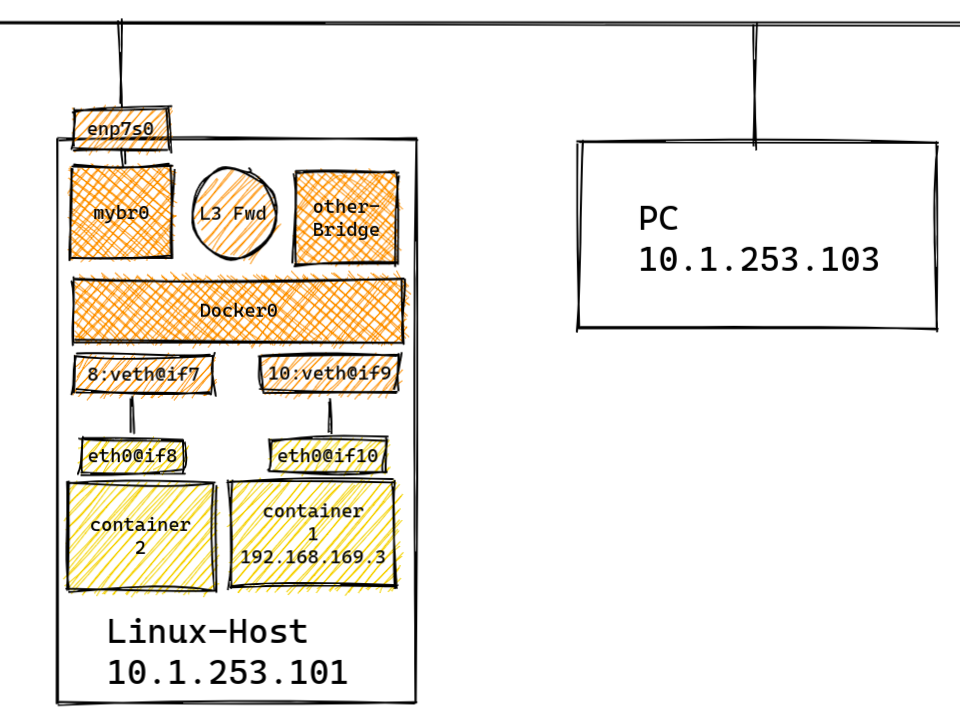
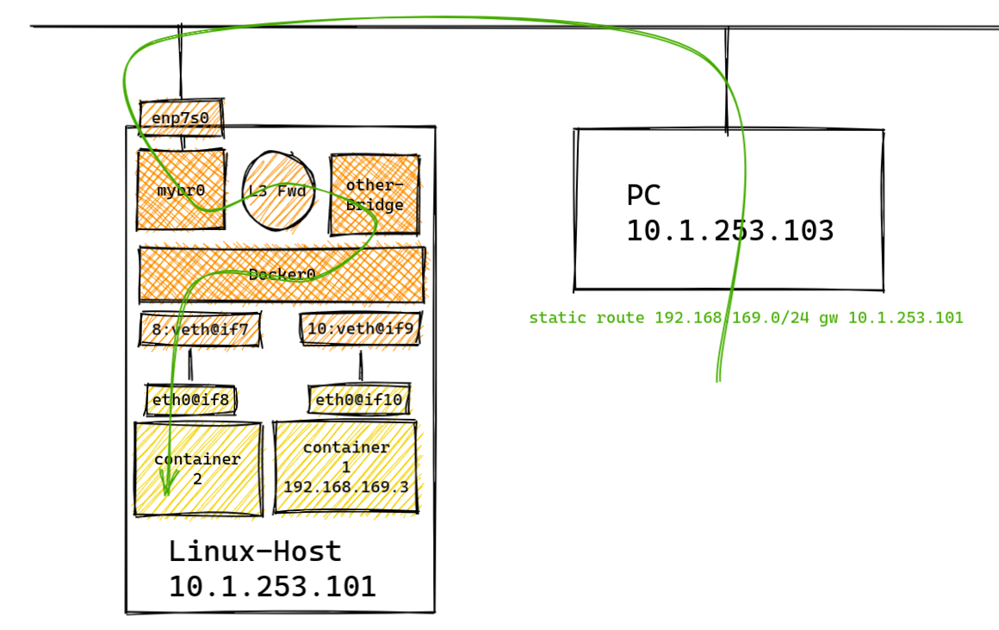
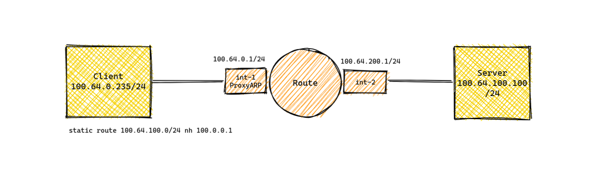
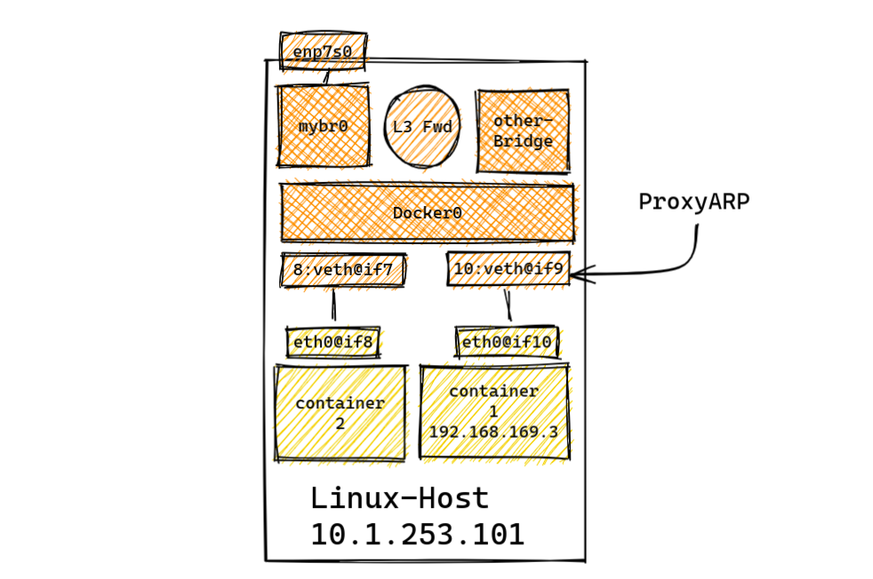

之前写了一篇K8S Calico的纯部署教程（[K8S Calico BGP 实现和路由设计](http://mp.weixin.qq.com/s?__biz=MzIzNjYxMjgyNg==&mid=2247483836&idx=1&sn=2d7a5dbeea4eff5d9fe8eeadf390d30c&chksm=e8d47c09dfa3f51f7995f1d435a882efcf824e62d4770e3a3eb7662a6ef758578c5a35830433&scene=21#wechat_redirect)），其中对容器基础通信过程描述不够完整，在家封闭满俩月，再憋出一篇文章，描述一下我理解的容器底层网络。

文档大致分为以下两部分：

- 以Docker bridge为例观察CONTAINER 与外部网络的通信
- 以K8S Calico 网络为例，观察POD与外部网络的通信

# 容器的基本通信

容器与虚拟机不同，其本质上是宿主机上的一个或多个线程，容器的通信直接嵌入进了宿主机操作系统中，借用宿主内核的协议栈进行通信。

与常规的应用软件监听宿主机的某几个特定端口不同，容器一般拥有独立的IP地址，其服务直接监听在该IP之上，外部网络一般访问宿主机IP+特定端口 的形式(DNAT) 或直接访问该独立IP 访问容器服务。

容器的独立IP地址配置在虚拟网卡中，其相对于宿主机而言就是一块loopback网卡，其与宿主机通信需要经过内核IP路由转发。

以流行的容器引擎Docker为例，其网络模型默认使用bridge模式。在我的homelab环境主机（管理IP 10.1.253.101）中运行着两个容器(container) ，使用`brctl show` 命令查看Linux bridge状态可以看到自动生成了一个名为`docker0`的bridge，即Docker在我的主机上创建了一个虚拟交换机供容器接入。可见其上关联了两张虚拟网卡（veth19f09f4 和 vethbd19ae5），这两张虚拟网卡分别链接了一个容器。

~~~shell
# brctl show 
bridge name	bridge id		STP enabled	interfaces
docker0		8000.0242cd4b7563	no		veth19f09f4
                               vethbd19ae5
mybr0    8000.726d56cd6c7c	no		enp7s0
~~~

使用`ifconfig`命令查看宿主机网卡信息，可以看到当前主机的管理网络(10.1.253.101)运行在mybr0 上，通过上面的`brctl show`信息可以看到该bridge通过物理网卡enp7s0 与物理网络链接；

~~~shell
enp7s0: flags=4163<UP,BROADCAST,RUNNING,MULTICAST>  mtu 1500
        ether 00:e0:6c:68:0d:c8  txqueuelen 1000  (Ethernet)
        RX packets 574798  bytes 165912882 (165.9 MB)
        RX errors 0  dropped 0  overruns 0  frame 0
        TX packets 532615  bytes 85784921 (85.7 MB)
        TX errors 0  dropped 0 overruns 0  carrier 0  collisions 0

mybr0: flags=4163<UP,BROADCAST,RUNNING,MULTICAST>  mtu 1500
        inet 10.1.253.101  netmask 255.255.255.0  broadcast 10.1.253.255
        inet6 fe80::706d:56ff:fecd:6c7c  prefixlen 64  scopeid 0x20<link>
        ether 72:6d:56:cd:6c:7c  txqueuelen 1000  (Ethernet)
        RX packets 309566  bytes 22825405 (22.8 MB)
        RX errors 0  dropped 0  overruns 0  frame 0
        TX packets 281614  bytes 55160097 (55.1 MB)
        TX errors 0  dropped 0 overruns 0  carrier 0  collisions 0

docker0: flags=4163<UP,BROADCAST,RUNNING,MULTICAST>  mtu 1500
        inet 192.168.169.1  netmask 255.255.255.0  broadcast 192.168.169.255
        inet6 fe80::42:cdff:fe4b:7563  prefixlen 64  scopeid 0x20<link>
        ether 02:42:cd:4b:75:63  txqueuelen 0  (Ethernet)
        RX packets 0  bytes 0 (0.0 B)
        RX errors 0  dropped 0  overruns 0  frame 0
        TX packets 5  bytes 446 (446.0 B)
        TX errors 0  dropped 0 overruns 0  carrier 0  collisions 0

veth19f09f4: flags=4163<UP,BROADCAST,RUNNING,MULTICAST>  mtu 1500
        inet6 fe80::58cb:efff:fe87:7c4  prefixlen 64  scopeid 0x20<link>
        ether 5a:cb:ef:87:07:c4  txqueuelen 0  (Ethernet)
        RX packets 0  bytes 0 (0.0 B)
        RX errors 0  dropped 0  overruns 0  frame 0
        TX packets 28  bytes 2152 (2.1 KB)
        TX errors 0  dropped 0 overruns 0  carrier 0  collisions 0

vethbd19ae5: flags=4163<UP,BROADCAST,RUNNING,MULTICAST>  mtu 1500
        inet6 fe80::68c1:95ff:febe:bd7d  prefixlen 64  scopeid 0x20<link>
        ether 6a:c1:95:be:bd:7d  txqueuelen 0  (Ethernet)
        RX packets 0  bytes 0 (0.0 B)
        RX errors 0  dropped 0  overruns 0  frame 0
        TX packets 26  bytes 1976 (1.9 KB)
        TX errors 0  dropped 0 overruns 0  carrier 0  collisions 0

~~~

网络逻辑如图：

同时可以看到bridge docker0运行IP地址192.168.169.1/24，该地址范围由`/etc/docker/daemon.json`文件定义（默认无此文件，默认IP范围为172.17.0.0/16），docker0嵌入到宿主机内核协议栈中，作为后端多个容器的网关。

- Note : 宿主机daemon.json文件：

  ~~~shell
  # cat /etc/docker/daemon.json 
  {
  "bip": "192.168.169.1/24"
  }
  ~~~

  

使用`docker ps` 获取当前运行的容器信息，使用`docker exec -it <CONTAINER ID> /bin/sh` 命令进入容器交互窗口，查看容器的网卡与IP信息：

~~~shell
root@e564:~# docker exec -it bfabf8306a8d /bin/sh 
# ip address
1: lo: <LOOPBACK,UP,LOWER_UP> mtu 65536 qdisc noqueue state UNKNOWN group default qlen 1000
    link/loopback 00:00:00:00:00:00 brd 00:00:00:00:00:00
    inet 127.0.0.1/8 scope host lo
       valid_lft forever preferred_lft forever
9: eth0@if10: <BROADCAST,MULTICAST,UP,LOWER_UP> mtu 1500 qdisc noqueue state UP group default 
    link/ether 02:42:c0:a8:a9:03 brd ff:ff:ff:ff:ff:ff link-netnsid 0
    inet 192.168.169.3/24 brd 192.168.169.255 scope global eth0
       valid_lft forever preferred_lft forever

~~~

注意容器网卡的命名方式为"xx@ifyy"，以这里的`9: eth0@if10`为例，`9: `代表容器为该网卡分配的nic id，`if10` 代表对应的宿主机网卡id 为10。

在宿主机上使用`ip address`命令可以看到该网卡`10: vethbd19ae5@if9 `即是容器关联的虚拟网卡，这里的`if9` 与容器内id 9 对应:

~~~shell
root@e564:~# ip address 
8: veth19f09f4@if7: <BROADCAST,MULTICAST,UP,LOWER_UP> mtu 1500 qdisc noqueue master docker0 state UP group default 
    link/ether 5a:cb:ef:87:07:c4 brd ff:ff:ff:ff:ff:ff link-netnsid 0
    inet6 fe80::58cb:efff:fe87:7c4/64 scope link 
       valid_lft forever preferred_lft forever
10: vethbd19ae5@if9: <BROADCAST,MULTICAST,UP,LOWER_UP> mtu 1500 qdisc noqueue master docker0 state UP group default 
    link/ether 6a:c1:95:be:bd:7d brd ff:ff:ff:ff:ff:ff link-netnsid 1
    inet6 fe80::68c1:95ff:febe:bd7d/64 scope link 
       valid_lft forever preferred_lft forever

~~~

在容器内查看路由信息，可以看到其网关IP地址为虚拟网桥docker0的IP：

~~~shell
# ip route 
default via 192.168.169.1 dev eth0 
192.168.169.0/24 dev eth0 proto kernel scope link src 192.168.169.3
~~~

容器内可以访问外部网络：

~~~shell
# ping 114.114.114.114 -c 1
PING 114.114.114.114 (114.114.114.114) 56(84) bytes of data.
64 bytes from 114.114.114.114: icmp_seq=1 ttl=82 time=11.1 ms

--- 114.114.114.114 ping statistics ---
1 packets transmitted, 1 received, 0% packet loss, time 0ms
rtt min/avg/max/mdev = 11.122/11.122/11.122/0.000 ms

~~~

到这里我们可以梳理一下容器网络的通信过程：

~~~shell
1、container 向114.114.114.114 发起ping，查询路由表将数据包路由给default gateway
2、宿主机上的docker0 作为网关收到数据包，根据目的IP地址进行查表并转发。

- docker0 是宿主机上的虚拟网桥，数据包到达docker0后会宿主机本地查寻路由表将其转发到外部网络
~~~

宿主机上的路由表：

~~~shell
root@e564:~# route -nee
Kernel IP routing table
Destination     Gateway         Genmask         Flags Metric Ref    Use Iface    MSS   Window irtt
0.0.0.0         10.1.253.1      0.0.0.0         UG    0      0        0 mybr0
10.1.253.0      0.0.0.0         255.255.255.0   U     0      0        0 mybr0    0     0      0
192.168.169.0   0.0.0.0         255.255.255.0   U     0      0        0 docker   0     0      0

~~~

熟悉网络的朋友应该能想到，上面仅描述了容器出局的路由查表过程，正常情况下由容器发起的数据包源IP应该是容器本机IP（192.168.169.3），该IP是容器内部地址，外部网络对该IP网段感知不到，那么114服务器是怎么给容器回包的呢？

观察上面的逻辑图可以发现，容器到达外部网络会经过多张虚拟网卡，我们分别在虚拟网卡`vethbd19ae5@if9` 和宿主机物理网卡`enp7s0`上抓包观察：

使用tcpdump 命令抓容器到宿主机的包(注意nic name 需要去掉@ifxx)：

~~~shell
root@e564:~# tcpdump  -i vethbd19ae5 -nn icmp
tcpdump: verbose output suppressed, use -v or -vv for full protocol decode
listening on vethbd19ae5, link-type EN10MB (Ethernet), capture size 262144 bytes
23:20:00.235025 IP 192.168.169.3 > 114.114.114.114: ICMP echo request, id 61, seq 56, length 64
23:20:00.793584 IP 114.114.114.114 > 192.168.169.3: ICMP echo reply, id 61, seq 56, length 64

~~~

再抓宿主机物理网卡的包：

~~~shell
root@e564:~# tcpdump  -i enp7s0 -nn icmp
tcpdump: verbose output suppressed, use -v or -vv for full protocol decode
listening on enp7s0, link-type EN10MB (Ethernet), capture size 262144 bytes
23:21:55.748044 IP 10.1.253.101 > 114.114.114.114: ICMP echo request, id 61, seq 56, length 64
23:21:55.758898 IP 114.114.114.114 > 10.1.253.101: ICMP echo reply, id 61, seq 56, length 64
~~~

可以看到宿主机将ping包发送到外部的时候将源IP修改成了本机IP，通过icmp报文的序列号seq 56 可以确认两个点抓到的包是同一个icmp request。

可以判断宿主机为容器做了SNAT，将容器IP地址隐藏在宿主机后面。

Linux下原生支持NAT的组件一般是内核模块iptables，我们使用`iptables -t nat -nvL`命令查看iptables的nat表，在其中POSTROUTING 链中读到一条rule：

~~~shell
root@e564:~# iptables -t nat -nvL POSTROUTING
Chain POSTROUTING (policy ACCEPT 23154 packets, 1522K bytes)
 pkts bytes target     prot opt in     out     source               destination         
    7   520 MASQUERADE  all  --  *      !docker0  192.168.169.0/24     0.0.0.0/0 
~~~

该rule 将入接口为* (any) 出接口为”非docker0“，且源IP为192.168.169.0/24 的数据包执行`MASQUERADE` 动作，MASQUERADE 是一种自动化的SNAT动作，其会将报文源IP自动转换成出局网卡的IP，即路由器上常常配置的easy-ip 模式的SNAT。

容器一般通过特定端口提供服务，因此宿主机还会为容器做目的端口转换。 

以docker官方提供的nginx为例，该容器监听在tcp 80端口，使用浏览器工具可以访问。

我们拉起一个nginx容器，将宿主机端口8081 映射到容器80端口，并使用`docker ps` 命令查看：

~~~shell
root@e564:~# docker run -d  -p 8081:80 nginx

root@e564:~# docker ps 
CONTAINER ID   IMAGE                         COMMAND                  CREATED         STATUS        PORTS                               NAMES
f1b03d6b1030   nginx                         "/docker-entrypoint.…"   4 seconds ago   Up 2 seconds   0.0.0.0:8081->80/tcp                great_meitner

~~~

在PC（10.1.253.103）上使用命令行工具`curl` 或者图形化浏览器可以访问该地址，看到可以看到空配的nginx容器返回 Welcome to nginx! ：

~~~shell
PC# curl 10.1.253.101:8081
<title>Welcome to nginx!</title>
~~~

同样的，查看宿主机的iptables可以看到相应的DNAT条目：

~~~shell
root@e564:~# iptables -nvL -t nat
Chain DOCKER (2 references)
 pkts bytes target     prot opt in     out     source               destination         
    1    60 DNAT       tcp  --  !docker0 *       0.0.0.0/0            0.0.0.0/0            tcp dpt:8081 to:192.168.169.4:80

~~~

可见iptables将来自“非docker0”网卡，且目的端口为8081的所有数据包执行DNAT动作，将其目的IP和端口转换为容器IP和端口。

以上就是Docker常规状态下的通信方式，利用宿主机的IP路由转发和iptables 的NAT 实现基础通信。

回到最开始，我们提到过docker0 类似于嵌入宿主机的一张loopback网卡。结合上文的逻辑图，很容易能想到可以通过添加关于192.168.169.0的静态路由实现外部PC直接访问容器，即在PC（10.1.253.103）上使用管理员权限的CMD添加一条临时静态路由：

~~~bash
管理员权限C:\Windows\system32> route add 192.168.169.0 mask 255.255.255.0 10.1.253.101
~~~

转发逻辑如图所示：

之后PC可以正常ping 通docker0 和内部容器，也可以直接以192.168.169.4:8081 访问nginx容器：

~~~shell
C:\Windows\system32>curl 192.168.169.4:80
<!DOCTYPE html>
<title>Welcome to nginx!</title>
C:\Windows\system32>
~~~

# 容器网络的自动化路由通告

在容器背景下，物理服务器纷纷开启了IP转发功能(将` net.ipv4.ip_forward=1 `置为1)，越来越多的依赖明细路由而非单纯依赖网关路由与其他节点通信。与传统网络的发展一样，容器网络业诞生了在容器集群内外自动通告路由条目的解决方案，K8S 背景下的calico  的bgp模式，就是对该种通信方式的最佳实现，部署在K8S 节点上的calico 容器间互相建立bgp 邻居、通告路由信息、甚至下发ACL 控制容器间的互访。关于calico的部署和配置可以参考这篇文章（[K8S Calico BGP 实现和路由设计](http://mp.weixin.qq.com/s?__biz=MzIzNjYxMjgyNg==&mid=2247483836&idx=1&sn=2d7a5dbeea4eff5d9fe8eeadf390d30c&chksm=e8d47c09dfa3f51f7995f1d435a882efcf824e62d4770e3a3eb7662a6ef758578c5a35830433&scene=21#wechat_redirect)）

# K8S 的基础通信逻辑

以K8S 的Calico 解决方案为例，为了方便理解本小节将K8S POD与CONTAINER 混称为“容器”，本节中的示例都可以简单的将POD理解成容器。

使用`kubectl get pod `命令获取POD信息，使用`kubectl exec -it <pod name> /bin/sh` 命令进入容器交互界面，在POD内查看IP地址和路由信息：

~~~shell
# kubectl exec -it nginx-584c7f6c79-49wgl /bin/sh
kubectl exec [POD] [COMMAND] is DEPRECATED and will be removed in a future version. Use kubectl exec [POD] -- [COMMAND] instead.
/ # ip add
1: lo: <LOOPBACK,UP,LOWER_UP> mtu 65536 qdisc noqueue state UNKNOWN qlen 1000
    link/loopback 00:00:00:00:00:00 brd 00:00:00:00:00:00
    inet 127.0.0.1/8 scope host lo
       valid_lft forever preferred_lft forever
3: eth0@if30: <BROADCAST,MULTICAST,UP,LOWER_UP,M-DOWN> mtu 1500 qdisc noqueue state UP 
    link/ether 4e:ce:42:f3:6b:01 brd ff:ff:ff:ff:ff:ff
    inet 10.244.109.225/32 scope global eth0
       valid_lft forever preferred_lft forever

/ # route -nee
Kernel IP routing table
Destination     Gateway         Genmask         Flags   MSS Window  irtt Iface
0.0.0.0         169.254.1.1     0.0.0.0         UG        0 0          0 eth0
169.254.1.1     0.0.0.0         255.255.255.255 UH        0 0          0 eth0

~~~

可以观察到容器被分配了一个/32 位IP地址，进一步查看路由信息可以看到存在两条迭代路由。

最早学习网络基础的时候，悟到ARP在MA网络二层寻址中的作用后做过一系列测试，把各种下一跳配置下ARP发包的逻辑整理了出来，其中一种情况就如K8S 给POD分配的IP与路由结构类似。

我们搭建一个简单的Lab 复现一下典型的Proxy ARP场景：

如图，物理网关路由器左侧接口配置为100.64.100.1/24,并开启APR代理，右侧接口配置为100.64.200.1/24 。将Clinet 配置为100.64.0.1/24 ，网关(默认路由)下一条配置为一个不存在的IP地址。

- Client 配置如下：

~~~shell
[root@node-235 ~]# ifconfig
ens4: flags=4163<UP,BROADCAST,RUNNING,MULTICAST>  mtu 1500
        inet 100.64.0.235  netmask 255.255.255.0  broadcast 100.64.0.255
        
[root@node-236 ~]# route add -net 0.0.0.0/0 gw 100.0.0.1
[root@node-235 ~]# route -nee
Kernel IP routing table
Destination     Gateway         Genmask         Flags Metric Ref    Use Iface    MSS   Window irtt
0.0.0.0         100.0.0.1       0.0.0.0         UG    0      0        0 ens4     0     0      0
~~~

- Server 配置如下：

~~~shell
[root@node-236 ~]# ifconfig
ens4: flags=4163<UP,BROADCAST,RUNNING,MULTICAST>  mtu 1500
        inet 100.64.200.236  netmask 255.255.255.0  broadcast 100.64.200.255

[root@node-236 ~]# route add -net 0.0.0.0/0 gw 100.64.200.1
[root@node-236 ~]# route -nee 
Kernel IP routing table
Destination     Gateway         Genmask         Flags Metric Ref    Use Iface    MSS   Window irtt
0.0.0.0         100.64.200.1    0.0.0.0         UG    0      0        0 ens4     0     0      0
~~~

- Route配置如下：

~~~shell
interface Ethernet1/1
  ip address 100.64.0.1/24
  ip proxy-arp

interface Ethernet1/2
  ip address 100.64.200.1/24

ip route 100.64.0.0/24 100.64.0.235
~~~

在Client上`ping 100.64.200.236`，能正常通信:

~~~shell
[root@node-235 ~]# ping 100.64.200.236  -c 2
PING 100.64.200.236 (100.64.200.236) 56(84) bytes of data.
64 bytes from 100.64.200.236: icmp_seq=1 ttl=63 time=2.18 ms
64 bytes from 100.64.200.236: icmp_seq=2 ttl=63 time=2.73 ms
~~~

抓包观察：

~~~shell
[root@node-235 ~]# tcpdump  -i ens4 -nn
15:26:26.933319 ARP, Request who-has 100.0.0.1 tell 100.64.0.235, length 28
15:26:26.935629 ARP, Reply 100.0.0.1 is-at 52:7b:81:16:1b:08, length 46
15:26:26.935652 IP 100.64.0.235 > 100.64.200.236: ICMP echo request, id 31541, seq 1, length 64
15:26:26.937863 IP 100.64.200.236 > 100.64.0.235: ICMP echo reply, id 31541, seq 1, length 64
15:26:27.935182 IP 100.64.0.235 > 100.64.200.236: ICMP echo request, id 31541, seq 2, length 64
15:26:27.937713 IP 100.64.200.236 > 100.64.0.235: ICMP echo reply, id 31541, seq 2, length 64
~~~

通过tcpdump信息可以看到:

- 当Client将默认路由下一条配置为不可达地址时，Client会直接向该NextHop地址发起arp请求（`who-has 100.0.0.1 tell 100.64.0.235`);

- 此时物理网关必须开启ProxyARP 才会响应并将自己的MAC地址回复给Clinet(`100.0.0.1 is-at 52:7b:81:16:1b:08`);

  - 查看路由器接口信息可以看到该MAC地址

    ~~~shell
    Route# show int ethernet 1/1
    Ethernet1/1 is up
    admin state is up, Dedicated Interface
      Hardware: 100/1000/10000 Ethernet, address: 527b.8116.1b08
    ~~~

  - 查看Client的ARP表也能看到对应ARP条目

    可以看到由于开起来代理ARP，路由器接口(52:7b:81:16:1b:08) 对应了两条ARP信息：

    ~~~shell
    [root@node-235 ~]# arp -n 
    Address                  HWtype  HWaddress           Flags Mask            Iface
    100.64.0.1               ether   52:7b:81:16:1b:08   C                     ens4
    100.0.0.1                ether   52:7b:81:16:1b:08   C                     ens4
    ~~~

该Lab中的路由配置逻辑与K8S POD中观察到的类似，很容易想到K8S网卡上应该开启了某种ARP代理通能。

结合验证LAB网卡位置判断，K8S中的代理ARP应该在这里：

定位POD所在宿主机，按照命名方式`xx@ifxx` 定位到目标网卡。在宿主机上查看该虚拟网卡的配置信息可见proxy_arp值被置为1,即开启状态：

~~~shell
cat /proc/sys/net/ipv4/conf/cali559a1e9f524/proxy_arp
1
~~~

在POD 内发起`/ # ping 114.114.114.114 `,同时在宿主机抓取对应网卡的包：

~~~shell
tcpdump -i caliad42e038a3f -nn 
16:21:15.807750 ARP, Request who-has 169.254.1.1 tell 10.244.109.225, length 28
16:21:15.807857 ARP, Reply 169.254.1.1 is-at ee:ee:ee:ee:ee:ee, length 28
16:21:10.465073 IP 10.244.109.225 > 114.114.114.114: ICMP echo request, id 48, seq 0, length 64
16:21:10.487311 IP 114.114.114.114 > 10.244.109.225: ICMP echo reply, id 48, seq 0, length 64
~~~

可以看到该ARP直接对NexHop地址发起ARP请求(`who-has 169.254.1.1 tell 10.244.109.225`);

同时网卡`caliad42e038a3f` 以虚拟mac地址`ee:ee:ee:ee:ee:ee` 回复。之后容器与外部网络以此MAC封装二层帧并完成通信。

通过以上的Lab我们梳理了容器的基本转发和NAT逻辑，但要理解容器网络必须要了解Network Namespace，下一篇文章我打算以k8s pause 容器入手深入梳理一下容器网络的实现。每个人对技术细节的理解都有不同，有错误的地方还请大家轻拍。
