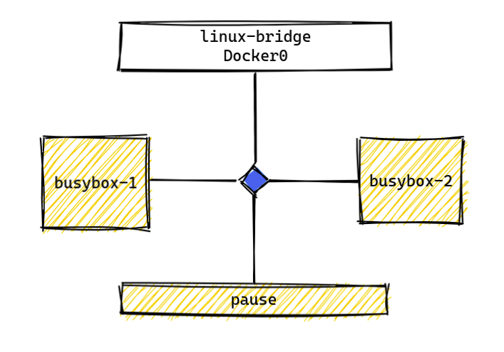
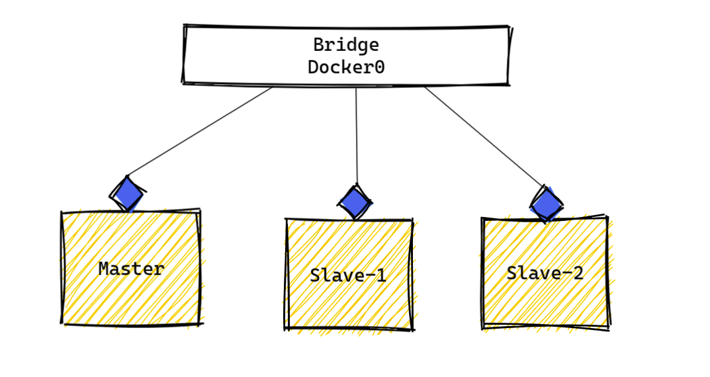
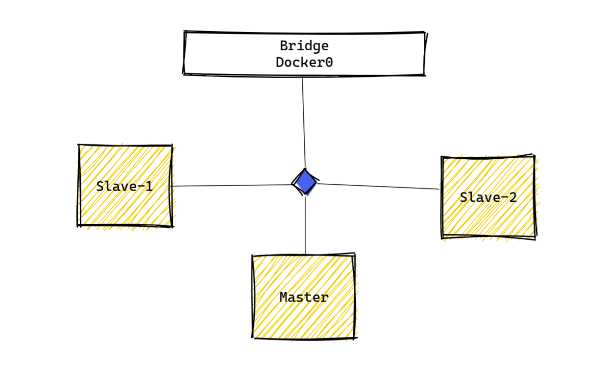
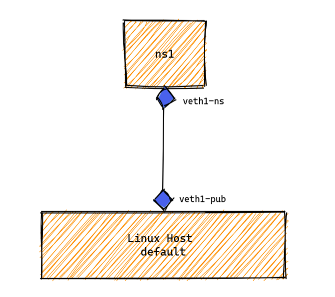
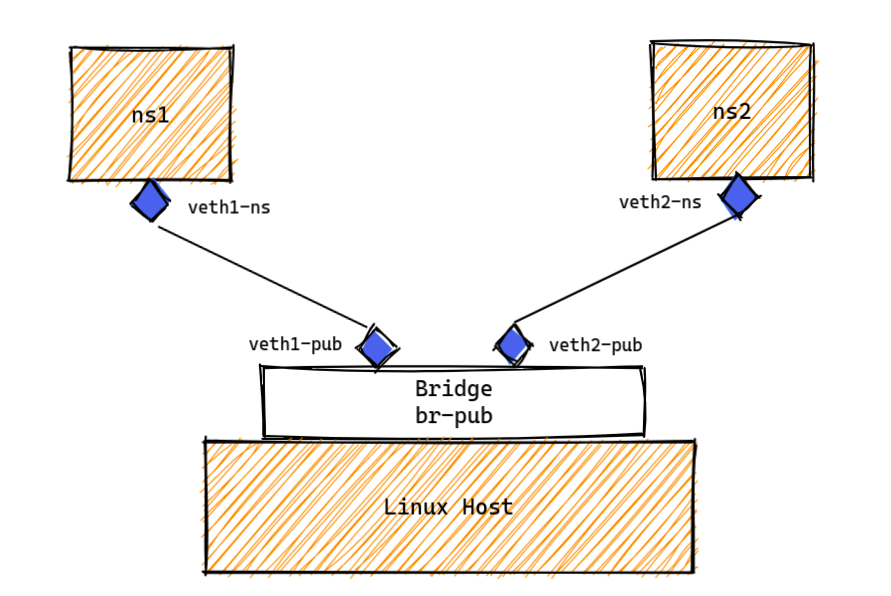

在上一篇文章 [浅谈K8S和容器网络实现](http://mp.weixin.qq.com/s?__biz=MzIzNjYxMjgyNg==&mid=2247483955&idx=1&sn=cd66d078cc3b179dad19e88db1181f48&chksm=e8d47f86dfa3f690c4ef2a68c8e199f2ed8cbba2e32508f3e4c366d0df93223bdfa20733a5b8&scene=21#wechat_redirect) 中梳理了容器网络的二三层转发逻辑和原生NAT，在[另一篇](http://mp.weixin.qq.com/s?__biz=MzIzNjYxMjgyNg==&mid=2247483836&idx=1&sn=2d7a5dbeea4eff5d9fe8eeadf390d30c&chksm=e8d47c09dfa3f51f7995f1d435a882efcf824e62d4770e3a3eb7662a6ef758578c5a35830433&scene=21#wechat_redirect)纯教程的文章中记录了Calico BGP模式的部署过程。赶在端午假期结束之前整理出本篇，试图站在一个传统网络工程师的角度上理解K8S下的POD、容器和其网络隔离。发现错误欢迎指出，共同交流。


# POD 与 容器

POD 是K8S 的最小管理单元，一个POD中可以运行一个或多个容器, 可实际上无论我们创建的POD中指定了几个container，K8S都还会帮我们拉起一个名为Pause的容器，这个容器使用`kubectl get pod ` 是看不到的，需要下沉到Docker中使用`docker ps` 命令查看。

那么这同一个POD 所管理的几个容器间彼此隔离还是共享？他们间能否互相通信又是以何种逻辑进行通信的呢？我们可以通过观察K8S的逻辑，并尝试使用Docker手动创建一组类似的容器来辅助理解。


举个例子:

在K8S 宿主机上运行着一个名为`nginx-584c7f6c79-5b7v8`的POD:

~~~shell
# kubectl get pod 
NAME                     READY   STATUS    RESTARTS   AGE
nginx-584c7f6c79-5b7v8   1/1     Running   0          2d17h
~~~

使用`docker ps ` 命令查看，并筛选相关的底层Docker 容器：

~~~shell
# docker ps |grep nginx-584c7f6c79-5b7v8   //过滤显示与“nginx-584c7f6c79-5b7v8“相关的容器
CONTAINER ID   IMAGE                 COMMAND                  CREATED        STATUS      PORTS                  NAMES
65f658cb3aff   51696c87e77e          "/docker-entrypoint.…"   2 days ago     Up 2 days                          k8s_nginx_nginx-584c7f6c79-5b7v8_default_1e427364-85bc-48ef-bfb7-527f8ba101dc_0
beb3c9001ea5   gcr.io/pause:3.2      "/pause"                 2 days ago     Up 2 days                          k8s_POD_nginx-584c7f6c79-5b7v8_default_1e427364-85bc-48ef-bfb7-527f8ba101dc_0
~~~

可以观察到有两Docker容器与这个Nginx POD相关，ID 为`65f658cb3aff`的容器是nginx真正的工作负载，ID 为`beb3c9001ea5`,镜像名为`pause`的容器某种意义上才是真正的K8S POD。


我们尝试手动创建一个拥有两个容器的POD，分别命名为`bsybox-1` 和`bsybox-2`：

~~~yaml
# cat pod-2container.yaml
apiVersion: v1
kind: Pod
metadata:
  name: pod-2c
  namespace: default
spec:
  nodeSelector:
    lb: enable
  containers:
  - name: bsybox-1
    image: busybox:latest
    command:
    - /bin/sh
    - -c
    - 'sleep 3600'
  - name: bsybox-2
    image: busybox:latest
    command:
    - /bin/sh
    - -c
    - 'sleep 3600'

# kubectl apply -f pod-2container.yaml
~~~


创建完毕后使用`describe` 命令查看POD的详细信息，删掉不相干信息后如下：

~~~shell
# kubectl describe pod pod-2c
Name:         pod-2c
Namespace:    default
Status:       Running
IP:           10.244.109.227
IPs:
  IP:  10.244.109.227
Containers:
  bsybox-1:
    Container ID:  docker://5077f4f95beadab84579d342e4ac7b8cc5010b6e5f385ccdaaa2c5e02a8221c5
    Image:         busybox:latest
    Image ID:      docker-pullable://busybox@sha256:5acba83a746c7608ed544dc1533b87c737a0b0fb730301639a0179f9344b1678
    Command:
      /bin/sh
      -c
      sleep 3600
    State:          Running
  bsybox-2:
    Container ID:  docker://91b76a640e7b9aea62ee3ba83ba23e8cd915f85736d95fb795f55c3da9ccd291
    Image:         busybox:latest
    Image ID:      docker-pullable://busybox@sha256:5acba83a746c7608ed544dc1533b87c737a0b0fb730301639a0179f9344b1678
    Command:
      /bin/sh
      -c
      sleep 3600
    State:          Running
~~~

使用`docker ps` 命令查看并筛选,同样可以看到一个`pause` 容器和两个busybox容器:

~~~shell
docker ps |grep pod-2c
CONTAINER ID   IMAGE           COMMAND                  CREATED        STATUS      PORTS                  NAMES
91b76a640e7b   busybox         "/bin/sh -c 'sleep 3…"   6 minutes ago   Up 6 minutes                          k8s_bsybox-2_pod-2c_default_28d06135-670a-41ae-83a7-840d5ac05c41_0
5077f4f95bea   busybox         "/bin/sh -c 'sleep 3…"   6 minutes ago   Up 6 minutes                          k8s_bsybox-1_pod-2c_default_28d06135-670a-41ae-83a7-840d5ac05c41_0
155eecbc366f   gcr/pause:3.2   "/pause"                 6 minutes ago   Up 6 minutes                          k8s_POD_pod-2c_default_28d06135-670a-41ae-83a7-840d5ac05c41_0

~~~


从以上精简后的`describe`输出信息可以看到两个container 是并列关系，而IP地址配置在“全局”，而非任一container 中。

K8S 下三个容器之间的逻辑关系似乎可以理解成这样：




我们可以从网络角度，以Docker的一个特殊网络类型 --  `container` 来辅助理解这个结构。


# Container模式的Docker网络


默认状态下Docker 容器创建的是`Bridge`类型的网络，多个容器关联到同一块名为Docker0的 LinuxBridge上，彼此间二层互通，Bridge Docker0 就是他们的网关，逻辑结构大概是这样：



- 注意： K8S的逻辑与Docker默认网络不同，以Calico网络解决方案为例，POD使用`/32`位IP地址，彼此间三层互通且依赖Proxy ARP。可以参考上一篇《浅谈K8S和容器网络实现》中Proxy ARP这部分）


`Container` 类型的网络与之不同，该网络模式是将新创建的Docker容器"附加"到一个已存在的容器之上，与这个以存在的容器共处于同一个网络命名空间。

我们尝试创建三个容器，分别命名为Master、Slave-1和Slave-2，利用`Container`类型网络将Slave-1、2附加到Master上，构建出与上一节 K8S 类似的拓扑：



首先创建容器“Master”：

~~~ shell
# docker run -it --name Master --net=bridge busybox
~~~

使用`docker inspect` 命令查看该docker 容器的IP信息，可以看到Docker网桥为其分配了地址`192.168.169.4`：

~~~shell
# docker inspect Master |grep IPAddress
            "SecondaryIPAddresses": null,
            "IPAddress": "192.168.169.4",
                    "IPAddress": "192.168.169.4",
~~~


再创建两个名为Slave-1、Slave-2的容器，将其网络类型指定为`container`并关联到Master。创建完毕后使用`ip address` 命令观察两容器的IP和网卡信息：

~~~shell
# docker run -it  --net=container:Master --name Slave-1 busybox
# docker run -it  --net=container:Master --name Slave-2 busybox
/ # ip add 
1: lo: <LOOPBACK,UP,LOWER_UP> mtu 65536 qdisc noqueue qlen 1000
    link/loopback 00:00:00:00:00:00 brd 00:00:00:00:00:00
    inet 127.0.0.1/8 scope host lo
       valid_lft forever preferred_lft forever
423: eth0@if424: <BROADCAST,MULTICAST,UP,LOWER_UP,M-DOWN> mtu 1500 qdisc noqueue 
    link/ether 02:42:c0:a8:a9:04 brd ff:ff:ff:ff:ff:ff
    inet 192.168.169.4/24 brd 192.168.169.255 scope global eth0
       valid_lft forever preferred_lft forever
~~~

可以看到两个Slave容器的IP地址与Master一致，再使用`docker inspect ` 命令查看 两Slave容器的信息，可以看到Docker未向其单独分配IP地址：

~~~shell
# docker inspect Slave-1 |grep IPAddress
            "SecondaryIPAddresses": null,
            "IPAddress": "",
~~~


从上面的输出来看，三个容器是在共享同一套IP地址。

进一步，尝试在三个容器中使用`ncat` 工具监听特定端口，在容器外部访问这些端口验证我们的观察：


在Master容器内，使用`nc `命令监听8000端口，Slave-1、2内监听8001和8002端口：

~~~shell
- Master:
/ # nc -l -p 8000

- Slave-1
/ # nc -l -p 8001

- Slave-2
/ # nc -l -p 8002
~~~

在任意一个容器内查看监听状态都可以看到另外两容器所监听的端口：

~~~shell
/ # netstat -tnl
Active Internet connections (only servers)
Proto Recv-Q Send-Q Local Address           Foreign Address         State       
tcp        0      0 0.0.0.0:8000            0.0.0.0:*                    LISTEN      
tcp        0      0 0.0.0.0:8001            0.0.0.0:*                    LISTEN 
~~~


在外部主机上可以与三个容器监听的`192.168.169.4`的`8000 - 8002`端口通信：

~~~shell
# nc -nz  192.168.169.4 8000 < /dev/null && echo "port established" 
port established
# nc -nz  192.168.169.4 8001 < /dev/null && echo "port established" 
port established
# nc -nz  192.168.169.4 8002 < /dev/null && echo "port established" 
port established
~~~

容器间可以使用loopback网卡完成内部通信：

~~~shell
/ # nc -nz 127.0.0.1 8000 < /dev/null && echo "port established"
port established
~~~


通过本节的Docker Lab，我们以一个比较直观方式理解了K8S pause容器与“workload”容器的关系，实际上pause不只是创建了一个共享的网络命名空间，还有uts、pid 等与宿主机隔离的共享“基础设施”，本文聚焦与网络，在此不做过多叙述。接下来我们尝试用一个简单的Lab理解容器间和容器与宿主机间的网络隔离与互联。


# Linux Network Namespace

Linux 下有多种namespace 用于隔离各种资源，其中Network Namespace 用于隔离网络资源

有些地方会拿net ns与网络设备的VRF 或者2层VLAN 类比，其实严格来看net ns 更像是防火墙的context 或者说虚墙，因为ns下有独立的iptables实例，可以实现3-4甚至7层的过滤和NAT。


#### Network Namespace的管理

可以使用iproute 软件包下的`ip netns` 命令管理netns：

- 创建一个netns 命名为ns1

~~~shell
# ip netns add ns1
# ip netns list
ns1
~~~

- 使用`ip netns exec ` 命令在netns中执行命令，默认netns 内的所有网卡都为down状态，需要使用`ip link set <nic_name> up`命令手动开启：

~~~shell
# ip netns exec ns1 ip addr
1: lo: <LOOPBACK> mtu 65536 qdisc noop state DOWN group default qlen 1000
    link/loopback 00:00:00:00:00:00 brd 00:00:00:00:00:00

# ip netns exec ns1 ip link set lo up
# ip netns exec ns1 ip addr
1: lo: <LOOPBACK,UP,LOWER_UP> mtu 65536 qdisc noqueue state UNKNOWN group default qlen 1000
    link/loopback 00:00:00:00:00:00 brd 00:00:00:00:00:00
    inet 127.0.0.1/8 scope host lo
       valid_lft forever preferred_lft forever
    inet6 ::1/128 scope host 
       valid_lft forever preferred_lft forever
       
# ip netns exec ns1 ip route
100.64.0.0/24 dev veth1-ns proto kernel scope link src 100.64.0.101 
[root@worknode ~]# ip netns exec ns1 route -nee
Kernel IP routing table
Destination     Gateway         Genmask         Flags Metric Ref    Use Iface    MSS   Window irtt
100.64.0.0      0.0.0.0         255.255.255.0   U     0      0        0 veth1-   0     0      0

~~~

可以看到新创建的netns 下拥有独立的网卡和独立的路由表。


#### 使用veth-pair 连通netns

可以使用虚拟网卡对将两个实例连通，逻辑上大概是这样：



- 首先创建一个网卡对，一端连接隔离的Netns ，命名为`veth1-ns` ，另一端连接公共主机命名为`veth1-pub` 

~~~shell
# ip link add name veth1-ns type veth peer veth1-pub
~~~

- 将`veth1-ns` 关联至netns 并手动开启

~~~shell
# ip link set dev veth1-ns netns ns1
# ip netns exec ns1 ip link set veth1-ns up
~~~

- 使用`ip netns exec` 命令在netns 中配置和查看IP地址：

~~~shell
# ip netns exec ns1 ip addr add  dev veth1-ns 100.64.0.101/24
# ip netns exec ns1 ip addr
1: lo: <LOOPBACK,UP,LOWER_UP> mtu 65536 qdisc noqueue state UNKNOWN group default qlen 1000
    link/loopback 00:00:00:00:00:00 brd 00:00:00:00:00:00
    inet 127.0.0.1/8 scope host lo
       valid_lft forever preferred_lft forever
    inet6 ::1/128 scope host 
       valid_lft forever preferred_lft forever
27: veth1-ns@if26: <BROADCAST,MULTICAST,UP,LOWER_UP> mtu 1500 qdisc noqueue state UP group default qlen 1000
    link/ether e2:2f:18:18:2e:bb brd ff:ff:ff:ff:ff:ff link-netnsid 0
    inet 100.64.0.101/24 scope global veth1-ns
       valid_lft forever preferred_lft forever
    inet6 fe80::e02f:18ff:fe18:2ebb/64 scope link 
       valid_lft forever preferred_lft forever
~~~

 如上一篇文章所述，使用`ip addr` 命令查看veth-pair 命名（`veth1-ns@if26`），其@符号后的ID`if26`即是网卡对另一块网卡的ID:

~~~shell
- 在宿主机上使用ip addr list 命令查看，可见网卡对的另一端ID为26
# ip addr
26: veth1-pub@if27: <BROADCAST,MULTICAST,UP,LOWER_UP> mtu 1500 qdisc noqueue master br-pub state UP group default qlen 1000
    link/ether 56:7e:49:99:82:0c brd ff:ff:ff:ff:ff:ff link-netns ns1
    inet6 fe80::547e:49ff:fe99:820c/64 scope link 
       valid_lft forever preferred_lft forever

~~~

- 为宿主机上虚拟网卡配置IP地址、查看路由信息：

~~~shell
# ip link set veth1-pub up
# ip addr add dev veth1-pub 100.64.0.200/24
# route -ne
Kernel IP routing table
Destination     Gateway         Genmask         Flags   MSS Window  irtt Iface
100.64.0.0      0.0.0.0         255.255.255.0   U         0 0          0 veth1-pub
~~~

- 此时两端可以互相ping 通

```shell
# ping 100.64.0.101 -c 1
PING 100.64.0.101 (100.64.0.101) 56(84) 比特的数据。
64 比特，来自 100.64.0.101: icmp_seq=1 ttl=64 时间=0.066 毫秒
```


在此基础之上，我们可以模仿Docker Bridge手动创建多个NetNS，每一个NS即代表一个容器，将容器互相桥接起来：

- 创建Linux bridge，命名为`br-pub`,并配置IP地址作为网关:

~~~shell
# ip link add br-pub  type bridge
# ip link set br-pub up
# ip addr add dev br-pub 100.64.0.1/24
~~~

- 将veth1-pub 绑定到`br-pub` ，使NS与Linux Bridge互通

~~~shell
- 清除veth1-pub的IP信息
# ip addr del dev veth1-pub 100.64.0.200/24

- 将网卡绑定到Linux Bridge
# ip link set dev veth1-pub master br-pub
# ip link set veth1-pub up 
~~~

此时，宿主机可以ping 通过`br-pub` ping通ns1：

~~~shell
# ping 100.64.0.101 -c 1
PING 100.64.0.101 (100.64.0.101) 56(84) 比特的数据。
64 比特，来自 100.64.0.101: icmp_seq=1 ttl=64 时间=0.139 毫秒
~~~

网桥`br-pub` 是宿主机的直连设备，查看路由可以看到相关条目：

~~~shell
# route -nee 
Kernel IP routing table
Destination     Gateway         Genmask         Flags Metric Ref    Use Iface    MSS   Window irtt
100.64.0.0      0.0.0.0         255.255.255.0   U     0      0        0 br-pub   0     0      0
~~~


如法炮制再创建一个netns 命名为`ns2` ，并创建网卡对`veth2-ns` 和 `veth2-pub` 并将其关联`ns2` 和`br-pub`，我们可以得到一个与Docker Bridge网络一致的拓扑：




使用`brctl show` 命令可以看到Linux 网桥与网卡的关联关系：

~~~shell
# brctl show 
bridge name	bridge id		STP enabled	interfaces
br-pub		8000.9ab5830bc9ae	no		veth1-pub
                                        veth2-pub
~~~

在宿主机上可以ping通两个netns 虚拟网卡

~~~shell
# ping 100.64.0.101 -c 1
PING 100.64.0.101 (100.64.0.101) 56(84) 比特的数据。
64 比特，来自 100.64.0.101: icmp_seq=1 ttl=64 时间=0.092 毫秒

# ping 100.64.0.102 -c 1
PING 100.64.0.102 (100.64.0.102) 56(84) 比特的数据。
64 比特，来自 100.64.0.102: icmp_seq=1 ttl=64 时间=0.120 毫秒
~~~


而且要注意，如同Docker Bridge网络一样，这里两容器之间是二层互通，因为我的`net.ipv4.ip_forward` 当前置0：

~~~shell
# sysctl -w net.ipv4.ip_forward=0
net.ipv4.ip_forward = 0
~~~

以Docker为例，当容器-1 通过`Public IP `加`Public Port` ，即以iptables 实现的DNAT辅助访问其它容器时，因为二层转发默认不过iptables，所以会有类似传统网络的`twice nat` 问题。需要注意使能Linux 内核参数`net.bridge.bridge-nf-call-iptables`  ，将二层流量也经由iptables处理。

K8S 下，当POD访问SVC iptables 提供的负载均衡服务时也应注意使能该参数。


#### 使用netns 命令查看每个容器的NetNamespace信息

Docker 容器的namespace文件默认放在`/var/run/docker/netns/` 下：

~~~shell
# ls -l /var/run/docker/netns/
总用量 0
-r--r--r--. 1 root root 0  5月 31 21:02 439c86260502
-r--r--r--. 1 root root 0  6月  1 10:54 89a0a79689cd
-r--r--r--. 1 root root 0  6月  1 10:54 cdfe7a59afba
-r--r--r--. 1 root root 0  6月  1 10:54 db3dad3bb328
-r--r--r--. 1 root root 0  5月 31 21:02 default
-r--r--r--. 1 root root 0  6月  4 23:00 ecc3451fb2c5
~~~


阅读man 手册得知，netns 默认将network namespace文件存放在`/var/run/netns/`下：

~~~shell
       By convention a named network namespace is an object at /var/run/netns/NAME that can be opened. The file descriptor resulting from opening /var/run/netns/NAME
       refers to the specified network namespace. Holding that file descriptor open keeps the network namespace alive. The file descriptor can be used with the
       setns(2) system call to change the network namespace associated with a task.

       For applications that are aware of network namespaces, the convention is to look for global network configuration files first in /etc/netns/NAME/ then in
       /etc/.  For example, if you want a different version of /etc/resolv.conf for a network namespace used to isolate your vpn you would name it
       /etc/netns/myvpn/resolv.conf.

~~~

​    PS 可以看到，man手册中将自定义的netns 称之为`myvpn`

手册中并未提到如何使用自定义netns 路径，可以创建一个软连将`/var/run/docker/netns/` 链接到`/var/run/netns/` 下，之后可以使用`ip netns ` 命令查看Docker容器的IP信息：

- 创建软链：

~~~shell
# ln -s /var/run/docker/netns/ /var/run/netns
# ls -l /var/run/netns/
总用量 0
-r--r--r--. 1 root root 0 6月   5 21:53 8e89a70e15d2
-r--r--r--. 1 root root 0 6月   5 17:49 ns1
~~~

- 在宿主机上使用`ip netns `命令查看容器的net namespace信息：

~~~shell
# ip netns exec 8e89a70e15d2 ip add
1: lo: <LOOPBACK,UP,LOWER_UP> mtu 65536 qdisc noqueue state UNKNOWN group default qlen 1000
    link/loopback 00:00:00:00:00:00 brd 00:00:00:00:00:00
    inet 127.0.0.1/8 scope host lo
       valid_lft forever preferred_lft forever
25: eth0@if26: <BROADCAST,MULTICAST,UP,LOWER_UP> mtu 1500 qdisc noqueue state UP group default 
    link/ether 02:42:c0:a8:aa:02 brd ff:ff:ff:ff:ff:ff link-netnsid 0
    inet 192.168.170.2/24 brd 192.168.170.255 scope global eth0
       valid_lft forever preferred_lft forever
       
# ip netns exec 8e89a70e15d2 iptables -t nat -nvL PREROUTING
Chain PREROUTING (policy ACCEPT 0 packets, 0 bytes)
 pkts bytes target     prot opt in     out     source               destination         

~~~


本章我们用Docker和 Linux ip命令手动模拟了K8S 和 Docker网络模型，相信大家对K8S POD 与容器的关系，对容器网络和Linux net namespace隔离有了一定的认识。

学习新方向新技术的过程总是枯燥的，自由时间又总会被零零散散的事占用，为了防止自己懈怠我选择将知识整理成文章，以输出倒逼输入。到这里容器网络告一段落，新的东西还有待学习，希望下一篇文章能尽早发出，大家改日再见！

